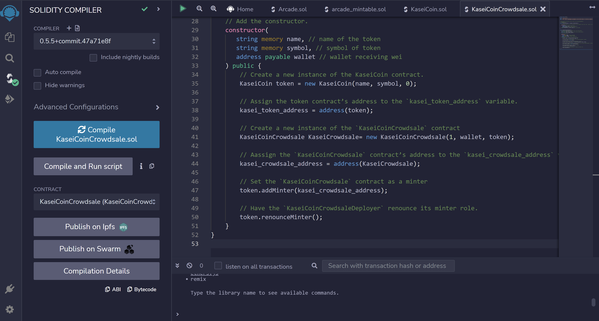

# Mars_Coin

A fictional ERC-20 token that will serve as the currency for the new mars colony! Get your Mars Coin today! The ONLY legal tender on the red planet! Trade in your outdated earth currency for MARS COIN by interacting with my Mars Coin Crowd Sale smart contract!!

---

## Technologies

This code was written on Windows 11 running Solidity (v0.5.7). Tested on Ganache (v2.5.4) and MetaMask (v10.21.2)

---

## Installation Guide

Solidity is the native language for the Ethereum Virtual Machine (EVM). It can be coded natively in Remix ide. To use the Remix ide either visit there website here: <https://remix.ethereum.org> or download the desktop app from there github here: <https://github.com/ethereum/remix-desktop/releases>. Ganache can be found here: <https://trufflesuite.com/ganache> and MetaMask can be found here: <https://metamask.io/download.html>.

---

## Usage

To interact with this contract you must first compile it and then deploy it into a test enviornment. I used Ganache and connected it to MetaMAsk. To do so you must open a new Ethereum chain in Ganache and then navigate to the "Add Network" tab in MetaMask. Set the RPC URL to HTTP://127.0.0.1:7545, and the Chain ID to 1337. The native currency is ETH. Then navigate to Remix ide, and compile KaseiCoinCrowdsale.sol and then deploy KaseiCoinCrowdsaleDeployer. You can select a coin name, symbol, and deployer address. I recommend using Mars Coin and MARS.

Then deploy KaseiCoinCrowdsale at the address given to you by the KaseiCoinCrowdsaleDeployer Contract in order to purchase Mars Coin tokens. To check balances of your test accounts you will also have to deploy the KaseiCoin contract at the address that is also given to you by the deployer contract.

Here is a screenshot of what you will see interacting with the contract through the Remix IDE.

At the below link you can see a video of me demonstrating how to interact with the contract:

<https://www.loom.com/share/924b45597c8743e1bb5ba758de956fde>

---

## Contributors

Garrett Hernandez -gtkhhz@gmail.com

---

## License

This is free and unencumbered software released into the public domain.

Anyone is free to copy, modify, publish, use, compile, sell, or
distribute this software, either in source code form or as a compiled
binary, for any purpose, commercial or non-commercial, and by any
means.

In jurisdictions that recognize copyright laws, the author or authors
of this software dedicate any and all copyright interest in the
software to the public domain. We make this dedication for the benefit
of the public at large and to the detriment of our heirs and
successors. We intend this dedication to be an overt act of
relinquishment in perpetuity of all present and future rights to this
software under copyright law.

THE SOFTWARE IS PROVIDED "AS IS", WITHOUT WARRANTY OF ANY KIND,
EXPRESS OR IMPLIED, INCLUDING BUT NOT LIMITED TO THE WARRANTIES OF
MERCHANTABILITY, FITNESS FOR A PARTICULAR PURPOSE AND NONINFRINGEMENT.
IN NO EVENT SHALL THE AUTHORS BE LIABLE FOR ANY CLAIM, DAMAGES OR
OTHER LIABILITY, WHETHER IN AN ACTION OF CONTRACT, TORT OR OTHERWISE,
ARISING FROM, OUT OF OR IN CONNECTION WITH THE SOFTWARE OR THE USE OR
OTHER DEALINGS IN THE SOFTWARE.

For more information, please refer to <https://unlicense.org>
